# Credit_Risk_Analysis

## Machine Learning to Predict Credit Risk

In this analysis I have used six machine learning models on existing loan data in order to decide which model can best predict credit risk. Each model is trained with a portion of the existing data and then tested for accuracy using the remaining data. A summary of the results are included below for each model's balanced accuracy score, precision and recall.

## Test Results

### Model: Oversampling with RandomOverSampler
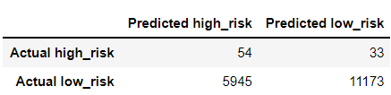
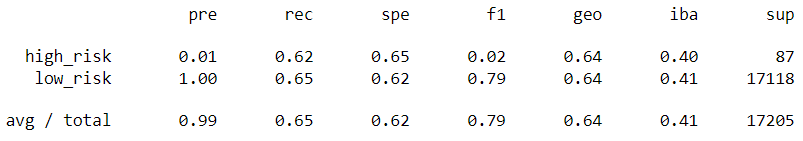

- The percentage of predictions that are correct for this model (balanced accuracy score) 

### Model: SMOTE Oversampling
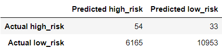
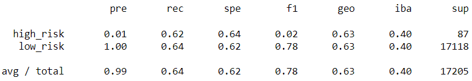

### Model: Undersampling with Cluster Centroids
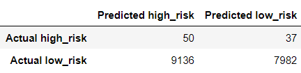
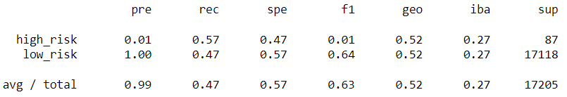

### Model: Combination (Over and Under) Sampling with SMOTEENN
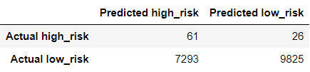
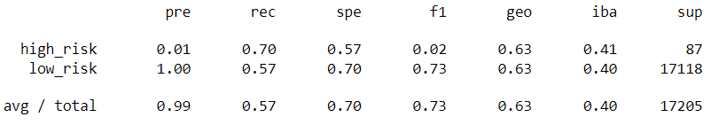

### Model: Balanced RandomForest Classifier
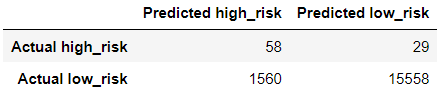
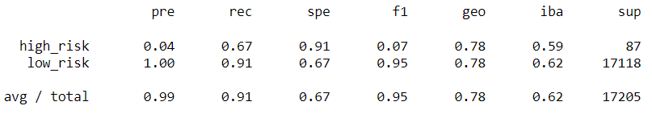

### Model: Easy Ensemble AdaBoost Classifier
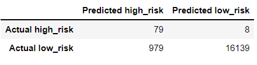
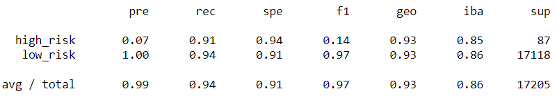